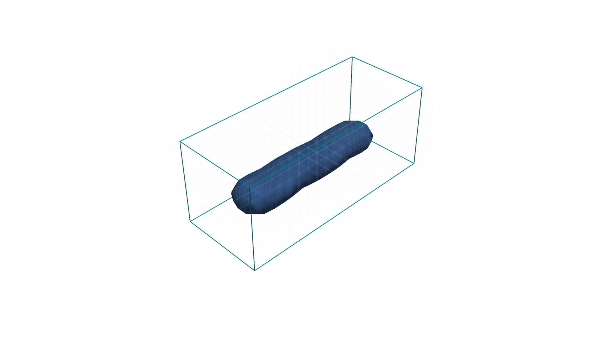

Architecture
============

3DP-DDS separates deposition events, numerical accumulation, immutable results,
derived analysis, persistence, and optional integrations.

Core data flow:

#. Targets and poses become :class:`dds.DepositionTarget` values.
#. Deposits combine targets with :class:`dds.BeadProfile`.
#. :class:`dds.Domain` maps world coordinates onto a voxel grid.
#. Kernel iterators sample bounded tiles.
#. Dense or chunked storage composes tiles into fields.
#. :class:`dds.SimulationResult` freezes the computed fields.
#. :class:`dds.analysis.simulation.SimulationAnalysis` derives query results.

   Each deposit reports conservative support bounds. Kernels evaluate only the
   affected voxel slices inside those bounds before the tiles are composed into
   the global field.
