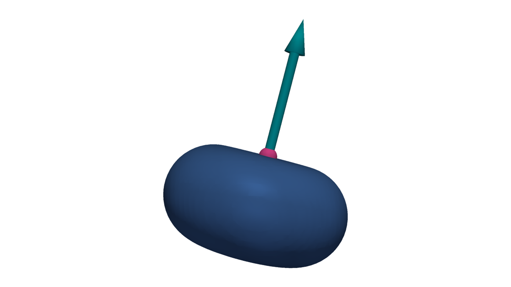

Coordinate Conventions
======================

3DP-DDS uses world-space coordinates in ``(x, y, z)`` order. Dense arrays use
the same axis order and NumPy ``indexing="ij"``.

Targets are top-referenced. A deposition target is usually a nozzle target at
the top of the bead, not the bead center. Bead height extends opposite the
target normal.

A :class:`dds.DepositionTarget` is defined by a world-space ``position`` and a
``normal`` vector. The constructor normalizes the vector, so its magnitude does
not encode a process parameter. The position fixes the bead top; the normal
defines the deposition axis and the direction away from the deposited
material.

   The bead extends from the target opposite the normal by
   :attr:`dds.BeadProfile.height`.

If a coordinate triplet is supplied where a target is accepted, DDS creates a
target with the default normal ``(0, 0, 1)``. Create an explicit
:class:`dds.DepositionTarget` when the deposition axis is not world ``+Z``.
