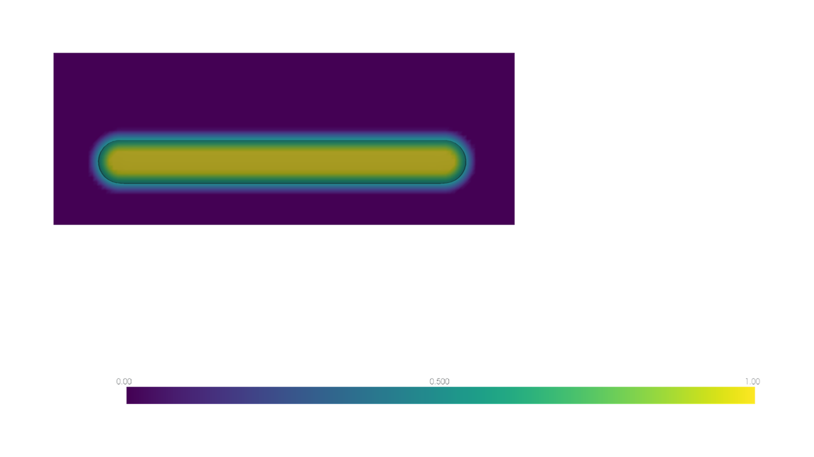
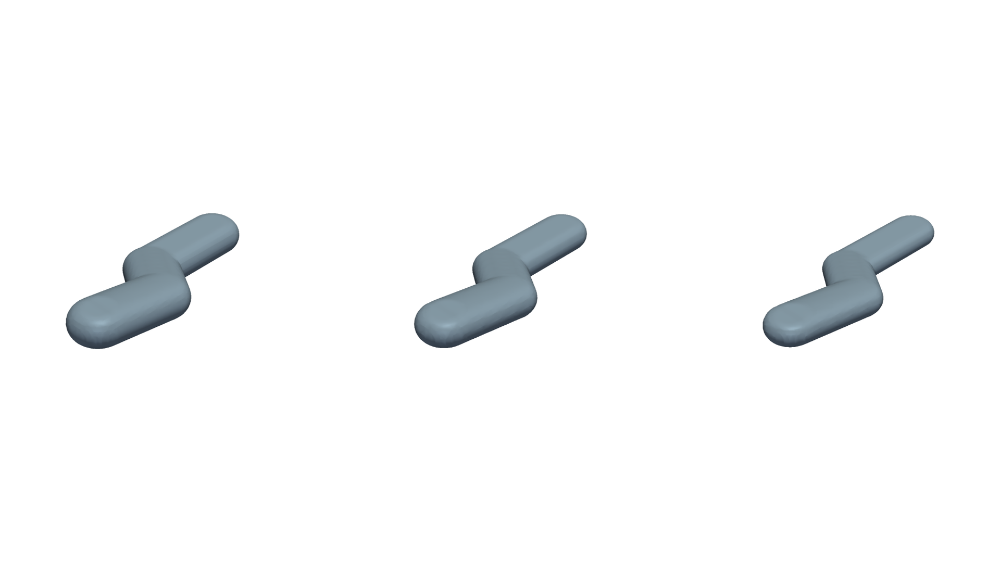
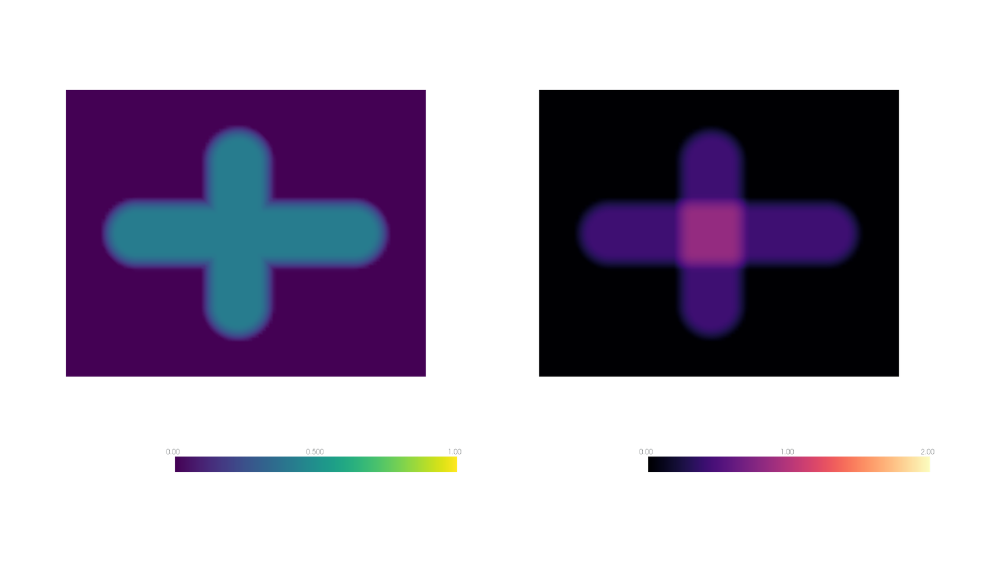
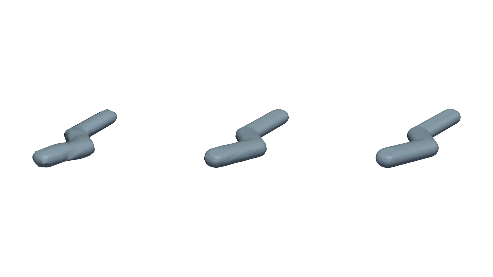
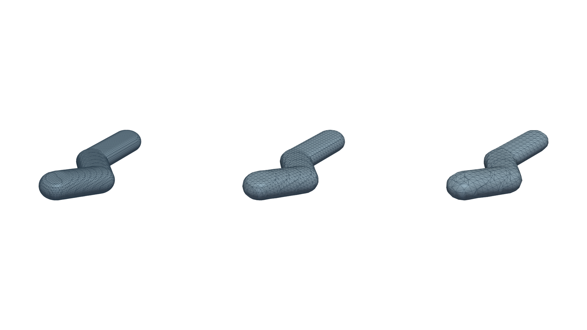

Fields And Thresholds
=====================

Implicit Field
--------------

The implicit field is the canonical fabricated geometry envelope. It is
nonnegative, clipped to ``[0, 1]``, and composed with maximum operations.

   A deposition kernel assigns a scalar influence to nearby voxels. The field
   remains continuous-valued until a query applies a threshold.

Occupancy And Surface Extraction
--------------------------------

Occupancy is obtained by thresholding the implicit field. The default threshold
is commonly ``0.5``.

   Left to right, surface extraction at thresholds ``0.3``, ``0.5``, and
   ``0.7``. The field is unchanged; only the selected isosurface changes.

Composition And Coverage
------------------------

Overlapping deposits are composed with a voxel-wise maximum. This produces the
fabricated envelope without increasing its implicit value simply because
several deposits overlap.

Coverage is additive and useful for locating overlap. It is not physical mass,
density, volume fraction, or flow.

   Left: the maximum-composed implicit field. Right: additive coverage, where
   brighter regions indicate contributions from more than one deposit.

Resolution Controls
-------------------

Voxel size controls the sampled field itself. Smaller voxels preserve more
geometric detail at greater memory and computation cost.

   Left to right, voxel sizes ``0.50``, ``0.25``, and ``0.12`` in domain units.

Mesh ``step_size`` controls marching-cubes sampling of an existing result; it
does not recompute the implicit field.

   Left to right, mesh step sizes ``1``, ``2``, and ``3``. Larger values produce
   a lighter, coarser preview.
