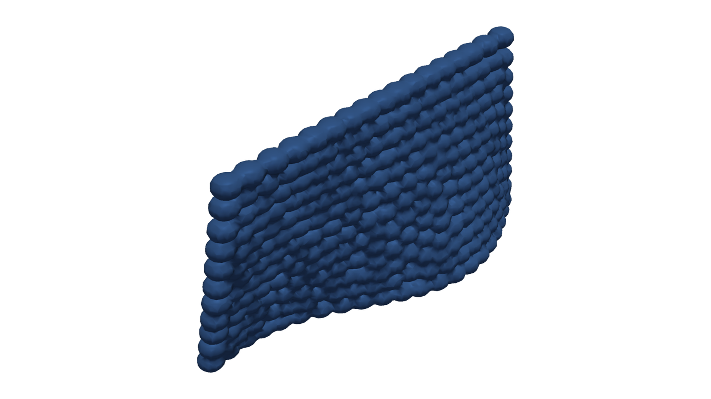

Modeling Assumptions
====================

3DP-DDS models deposited geometry, not coupled process physics.

It does not model material flow conservation, extrusion transients, gravity,
sagging, curing, cooling, thermal history, collision, reachability, robot
dynamics, controller timing, bead deformation, uncertainty propagation, or
experimental calibration.

   The example wall is a geometric deposited envelope. Its shape does not imply
   material-flow, curing, thermal, collision, or robot-behavior predictions.

For quantitative work, report domain bounds, length unit, voxel size,
threshold, bead profile, and path definition. Run convergence checks across
voxel sizes when the result is used as evidence.
