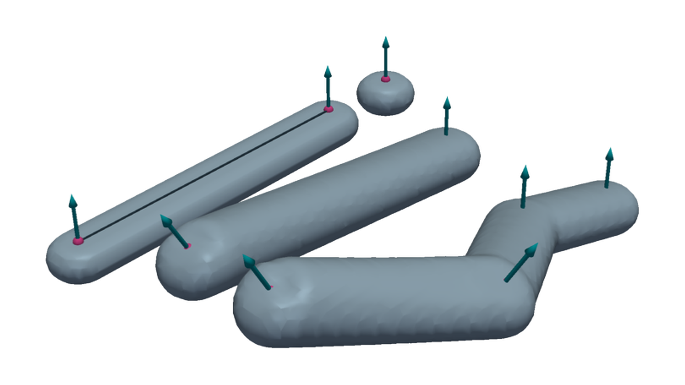

3DP-DDS Documentation
=====================

3DP-DDS is a geometry-first Python library for dense deposition simulation on
3D voxel grids. It represents additive-manufacturing paths as point, line, and
polyline deposition events, samples bead geometry into fields, and exposes
analysis queries for occupancy, interfaces, signed distance, and support risk.

The current model is intentionally geometric. It does not simulate thermal
history, material flow, curing, robot dynamics, controller behavior, or bead
deformation.

   Point, line, and polyline deposition primitives share the same
   implicit-field backend.

.. note::

   This documentation was generated automatically with assistance from a large
   language model (LLM). Treat it as developer guidance and verify critical
   behavior against the source code and tests.

.. toctree::
   :maxdepth: 2
   :caption: User Guide

   getting-started
   tutorials/index
   concepts/index

.. toctree::
   :maxdepth: 2
   :caption: Reference

   api/index
