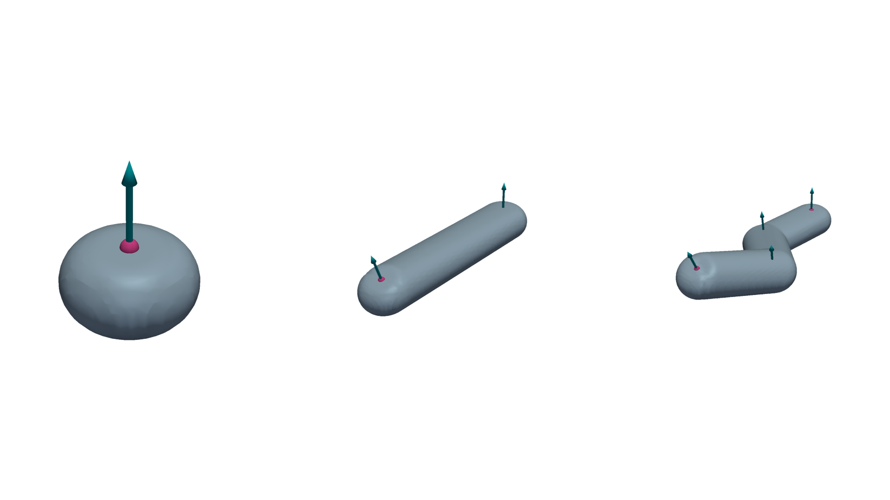
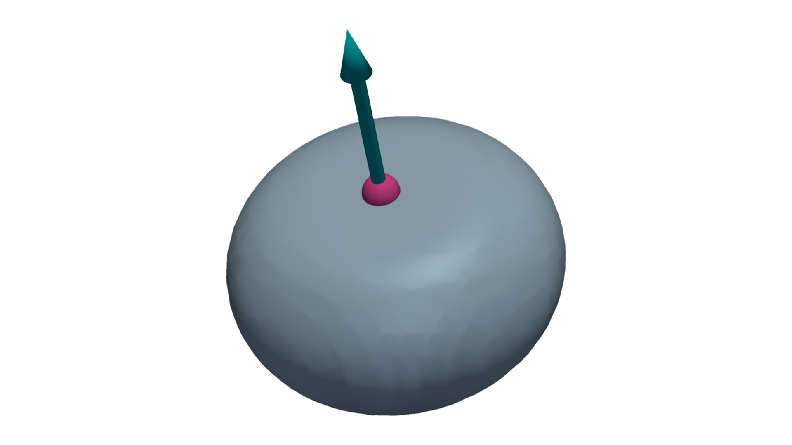
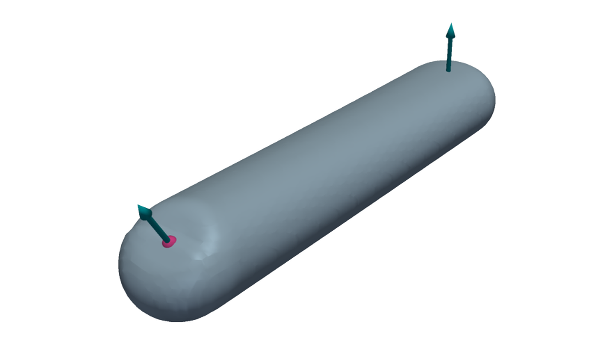
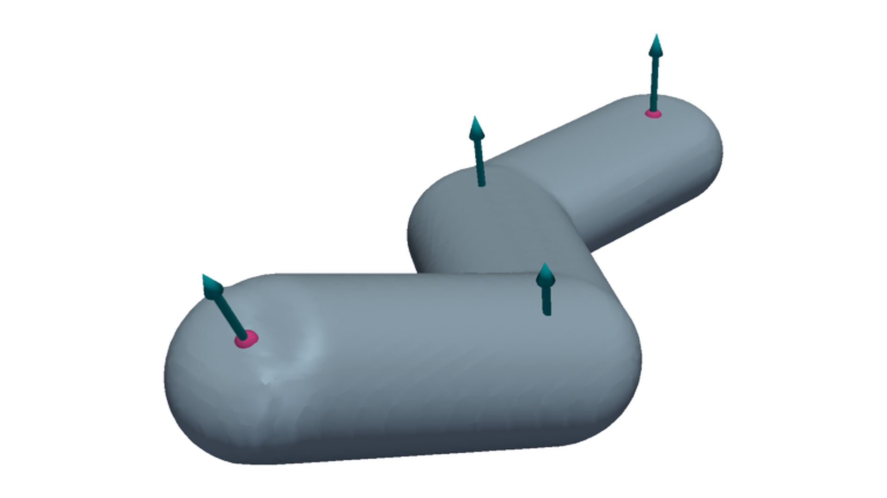
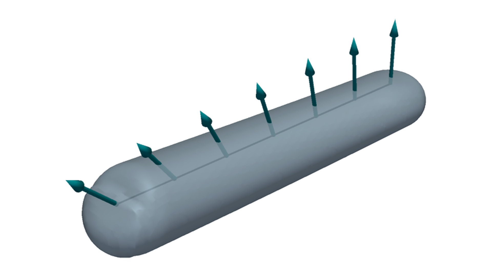

Deposits
========

Deposits combine top-referenced targets with bead dimensions. Coordinate
triplets are interpreted as world ``+Z`` targets.

   Left to right: one-target point deposition, two-target line sweep, and an
   ordered multi-target polyline sweep.

Deposition Targets
------------------

A :class:`dds.DepositionTarget` stores a position and a normalized deposition
normal. Its position marks the top of the bead. If only a coordinate triplet is
provided, DDS uses the default normal ``(0, 0, 1)``.

.. code-block:: python

   from dds import BeadProfile, DepositionTarget

   profile = BeadProfile(width=1.2, height=0.6)
   tilted = DepositionTarget(
       position=(2.0, 2.0, 0.6),
       normal=(0.25, 0.0, 1.0),
   )

Point Deposits
--------------

:class:`dds.PointDeposit` combines one target with one bead profile. It
evaluates a single oriented bead volume.

.. code-block:: python

   from dds import PointDeposit

   point = PointDeposit(target=tilted, profile=profile)

   A point deposit has one position, one normal, and one bead profile.

Line Deposits
-------------

:class:`dds.LineDeposit` sweeps a bead profile between two targets. The start
and end positions define the path segment; their normals define the orientation
at its ends.

.. code-block:: python

   from dds import LineDeposit

   line = LineDeposit(
       start=DepositionTarget((2.0, 2.0, 0.6), normal=(0.0, 0.0, 1.0)),
       end=DepositionTarget((10.0, 2.0, 1.2), normal=(0.35, 0.0, 1.0)),
       profile=profile,
   )

   The finite segment is one deposition event, not merely a connection between
   two point deposits.

Polyline Deposits
-----------------

:class:`dds.PolylineDeposit` accepts an ordered sequence of two or more targets
and applies one bead profile to every consecutive segment. Use it to represent
one connected multi-segment fabrication event.

.. code-block:: python

   from dds import PolylineDeposit

   polyline = PolylineDeposit(
       targets=(
           (2.0, 2.0, 0.6),
           (6.0, 2.0, 0.6),
           DepositionTarget((9.0, 5.0, 1.0), normal=(0.2, 0.1, 1.0)),
       ),
       profile=profile,
   )

   Consecutive targets become line segments while remaining one ordered
   polyline deposit.

Normal Interpolation
--------------------

During a line or polyline sweep, DDS interpolates between endpoint normals and
renormalizes the result. This allows the bead orientation to change smoothly
along a path. Exactly antiparallel consecutive normals are rejected because
their interpolation direction is ambiguous.

   The path position and deposition normal both vary along the sweep.
