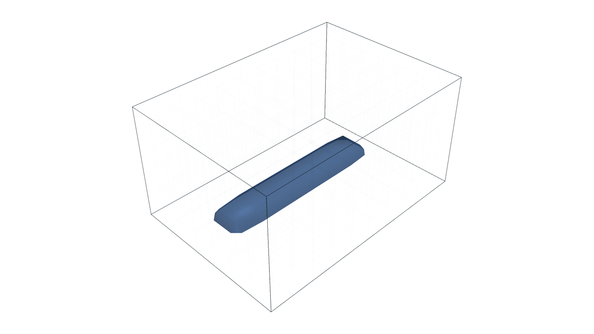
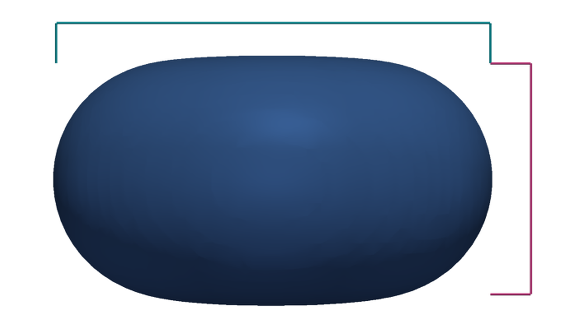

Domains And Beads
=================

The :class:`dds.Domain` defines the sampled workspace. It stores lower and
upper bounds, voxel size, grid shape, and a unit label.

.. code-block:: python

   from dds import Domain

   domain = Domain.from_bounds(
       xmin=0.0,
       xmax=20.0,
       ymin=0.0,
       ymax=20.0,
       zmin=-1.0,
       zmax=5.0,
       voxel_size=0.25,
       length_unit="mm",
   )

   The domain fixes the sampled workspace and its voxel resolution. Deposited
   geometry outside these bounds is not represented.

Arrays use ``(x, y, z)`` order. World coordinates map to voxel indices through
:meth:`dds.Domain.world_to_index`; indices map back to voxel centers through
:meth:`dds.Domain.index_to_world`.

Bead dimensions are explicit:

.. code-block:: python

   from dds import BeadProfile

   profile = BeadProfile(width=1.2, height=0.6)

   Width is measured transverse to the deposition normal; height is measured
   along it, extending opposite the normal from the top-referenced target.

Every deposit must provide a :class:`dds.BeadProfile`.
