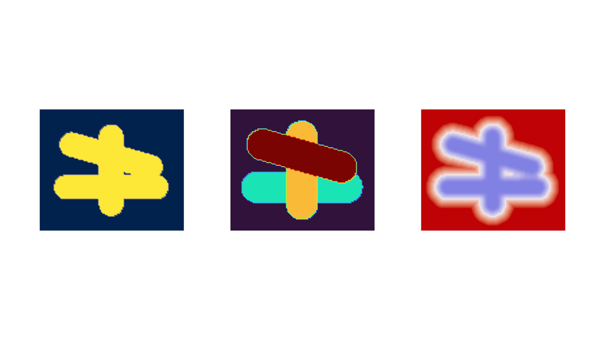

Results And Analysis
====================

:class:`dds.SimulationResult` stores immutable fields and metadata. Derived
queries live on :attr:`dds.SimulationResult.analysis`.

.. code-block:: python

   analysis = result.analysis
   occupancy = analysis.occupancy()
   index = analysis.deposition_index_field()
   value = analysis.sample_implicit_value((1.0, 0.0, 0.3))
   distance = analysis.signed_distance_at((1.0, 0.0, 0.3))

The implicit field is not itself a signed-distance field. Use
:meth:`dds.analysis.simulation.SimulationAnalysis.surface_sdf` when metric
distance is needed.

   Left to right: thresholded occupancy, last-touch deposition index, and
   signed distance to the extracted surface.

Analysis fields are derived from an immutable result and cached on first use.
Occupancy depends on the result threshold. The deposition-index field identifies
the latest deposit contributing to each represented location; ``-1`` marks
locations with no contribution.
