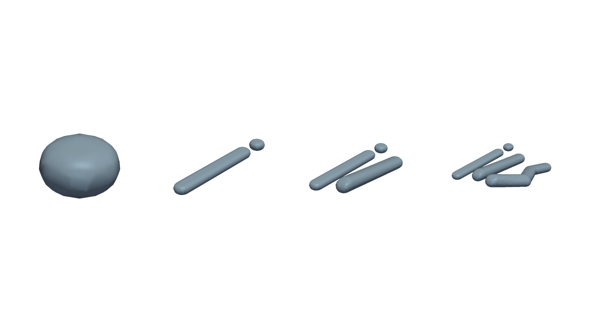

Simulation Workflows
====================

Use :func:`dds.simulate` when all deposits are known:

.. code-block:: python

   from dds import simulate

   result = simulate(domain, deposits, include_coverage=True, threshold=0.5)

Use :class:`dds.Simulator` when deposits arrive over time:

.. code-block:: python

   from dds import Simulator

   simulator = Simulator(domain)
   simulator.add_deposits(deposits[:5])
   first = simulator.result()
   simulator.add_deposits(deposits[5:])
   second = simulator.result(include_coverage=True)

Result snapshots are immutable. Later simulator changes do not mutate older
snapshots.

   Left to right, each snapshot contains one additional deposition event. A
   later simulator update creates a new result instead of mutating prior
   results.
